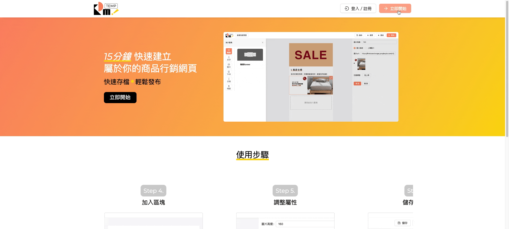

# EDMTEMP

### Desing your own page from [EDMTEMP](https://edmtemp.com/)

EDMTEMP is a website page editor which can create your own marketing pages.
You can add banner, title, text, space, tab to your pages.

## Live Demo

- Website URL： [EDMTEMP](https://edmtemp.com/)
- Login  
  
- Edit and Publish
  

### Front-end Skills

- Used `React Hook` and `React-Router` to implement Single Page Application（SPA）, making the user experience better.
- Used `styled-components` to write CSS.
- Used `Redux` to manage the state of PageList, Component, undoStack, Components, and store to `LocalStorage` .
- Used `Antd` to Design Dashboard and Edit pages

### Back-end Skills

- Used `Firebase` back-end service platform to set up the website
  - Add custom domain ( Hoisting ),
  - Membership system ( Sign-in method : Email & Password, googleAuth),
  - Database ( Firestore )
  - Store images ( Storage ).
